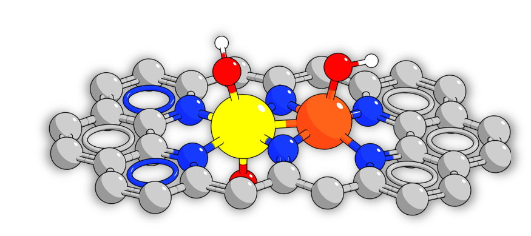
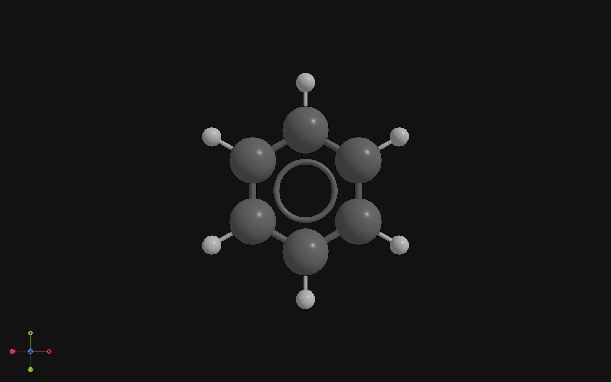
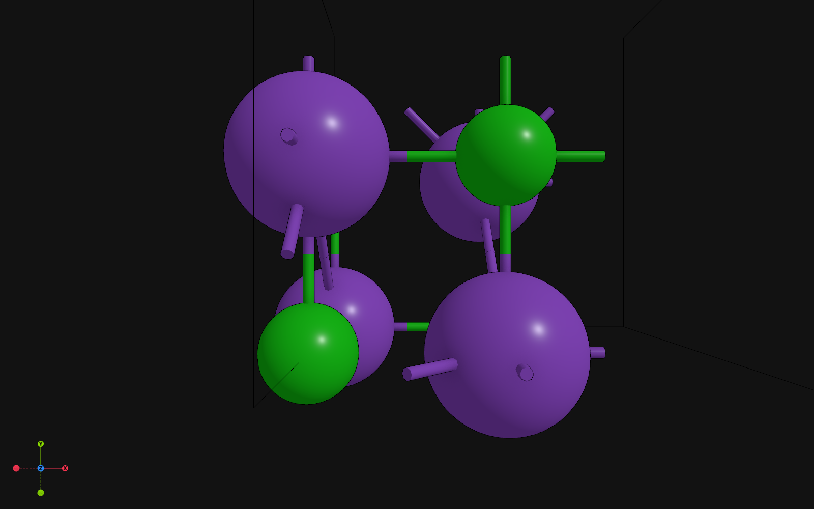
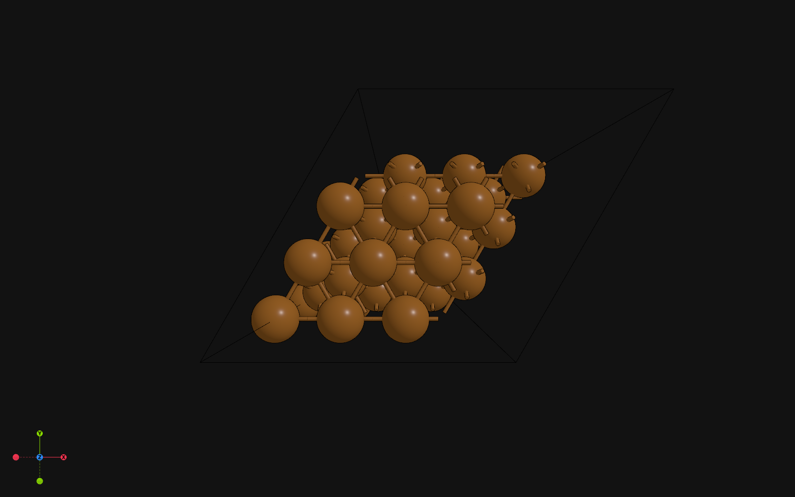
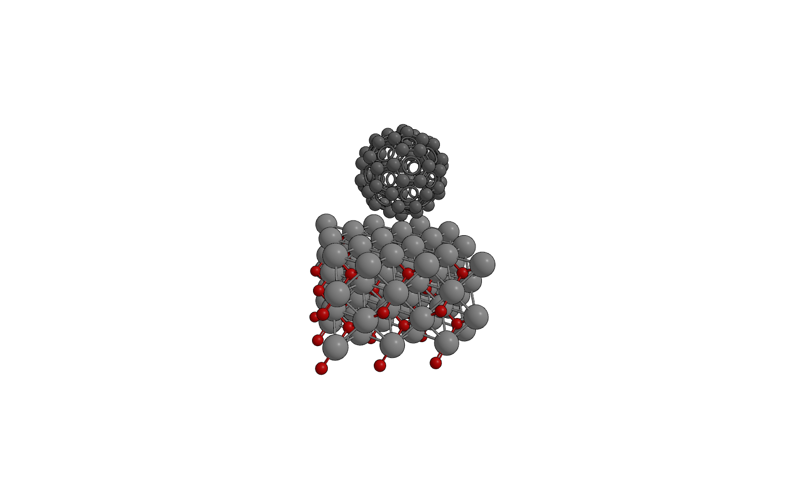
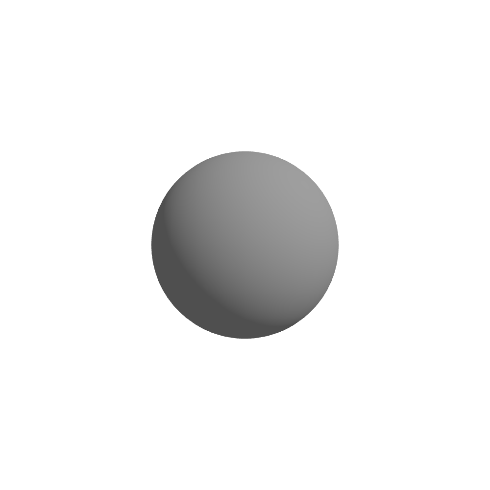
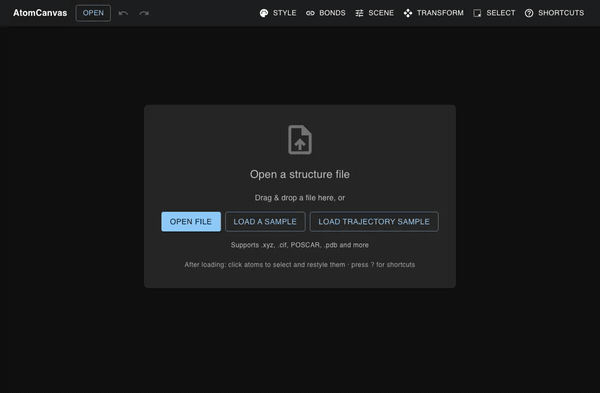

<div align="center">

# AtomCanvas

**A focused, canvas-first viewer for atomic structures.**
Drop in a structure file → clean, correctly-colored 3D → tune bonds, styling, and
scene → export publication-ready figures, portable presets, and 3D models.

[](https://github.com/zyc2806/atomcanvas/actions/workflows/ci.yml)
[](LICENSE)
[](backend/pyproject.toml)



</div>

AtomCanvas is a **visualization-only** atomic-structure viewer — no
calculations, no MD, no HPC, just rendering and export done well. A stateless
FastAPI backend parses structures with ASE and infers bonding; a React 19 +
React Three Fiber frontend does the rest in your browser.

## Gallery

<table>
  <tr>
    <td align="center" width="33%"><br><sub>Molecules</sub></td>
    <td align="center" width="33%"><br><sub>Crystals</sub></td>
    <td align="center" width="33%"><br><sub>Surfaces</sub></td>
  </tr>
</table>

See the full **[gallery](docs/GALLERY.md)** and the annotated
**[feature tour](docs/FEATURES.md)**.

## Rendering styles

Switch instantly between three built-in render styles — a clean **standard**
ball-and-stick, **soft** ambient shading, or a **cartoon** toon outline — to match
the figure you need.

<table>
  <tr>
    <td align="center" width="33%"><br><sub><b>Standard</b></sub></td>
    <td align="center" width="33%"><br><sub><b>Soft</b></sub></td>
    <td align="center" width="33%"><br><sub><b>Cartoon</b></sub></td>
  </tr>
</table>

<sub>Standard: C<sub>60</sub> on an Ag<sub>2</sub>O surface. Soft: a 2D covalent framework. Cartoon: a metal macrocycle.</sub>

**See it in action** — upload → rotate → edit a bond → export:

<div align="center">
  
</div>

## Quickstart

The fastest path needs only [Docker](https://docs.docker.com/get-docker/):

```bash
docker build -t atomcanvas .
docker run --rm -p 8000:8000 atomcanvas
# then open http://localhost:8000
```

Prefer to run from source, on Windows, or for development? See **[docs/RUN.md](docs/RUN.md)**.

**Prefer the command line?** AtomCanvas ships a headless CLI — bond detection,
the selection DSL, and structure conversion, no browser required:

```bash
pip install ./backend                    # adds the `atomcanvas` command
atomcanvas bonds fixtures/benzene.xyz    # bonds, bond orders, aromatic rings
atomcanvas convert POSCAR out.cif        # convert between structure formats
```

`render` additionally exports pixel-accurate figures and `.glb` models
headlessly — see the **[CLI reference](docs/CLI.md)**.

## Features at a glance

- **Load** common formats — XYZ/extXYZ, CIF, VASP POSCAR, PDB, … (parsed with ASE).
- **Automatic bonding** — covalent-radius detection with a tunable threshold,
  PBC-aware ghost atoms, hydrogen bonds, and RDKit bond orders + aromatic rings.
- **Manual bond editing** — pick two atoms to create / re-order / delete a bond;
  every override is reversible.
- **Selection DSL** — `elem:C AND pos:z>10`, `label:O1,H1`, with `AND`/`OR`/`NOT`
  and parentheses ([grammar](docs/CLI.md#selection-dsl)).
- **Styling** — per-element / per-atom colors and radii, plus camera, background,
  and lighting; pick a display mode (ball-and-stick · vdW · wireframe) and a
  render style (standard · soft · cartoon).
- **Multiple structures in tabs** with batch export, and **trajectory playback**.
- **Export** — supersampled PNG, `.glb` (PowerPoint-ready), and portable
  scene/style presets ([reference](docs/EXPORT.md)).
- **Headless CLI** — bonding, the selection DSL, structure conversion, and
  pixel-accurate figure / `.glb` export (via `render`) all run without the
  browser ([reference](docs/CLI.md)).

## Documentation

- **[Run & install](docs/RUN.md)** — Docker, source, Windows, dev stack, env vars, troubleshooting.
- **[Gallery](docs/GALLERY.md)** — the visual showcase.
- **[Feature tour](docs/FEATURES.md)** — annotated, step by step.
- **[Command line](docs/CLI.md)** — headless CLI + selection-DSL grammar.
- **[Exporting](docs/EXPORT.md)** — formats, scene/style docs, glb → PowerPoint.
- **[Architecture](docs/ARCHITECTURE.md)** — how the stateless backend + R3F frontend fit together.
- **[Contributing](CONTRIBUTING.md)** — dev workflow, the gate, conventions.

## Contributing

Contributions are welcome — see **[CONTRIBUTING.md](CONTRIBUTING.md)** for the
developer workflow, the test gate, and project conventions.

## Acknowledgements

AtomCanvas stands on [ASE](https://wiki.fysik.dtu.dk/ase/) (structure parsing and
chemistry), [RDKit](https://www.rdkit.org/) (bond-order and aromatic-ring
perception), [React Three Fiber](https://github.com/pmndrs/react-three-fiber) and
[drei](https://github.com/pmndrs/drei) (3D rendering), and
[FastAPI](https://fastapi.tiangolo.com/) (the backend API).

## License

Released under the [MIT License](LICENSE).
