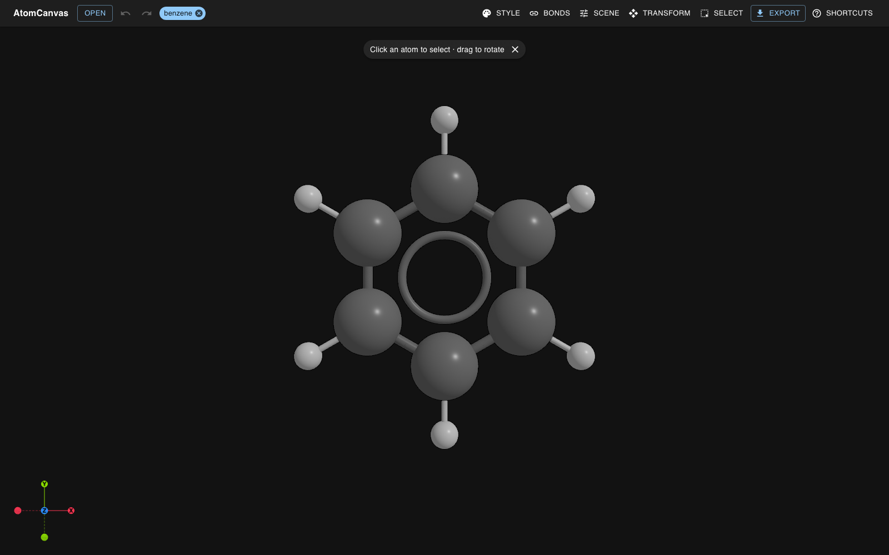
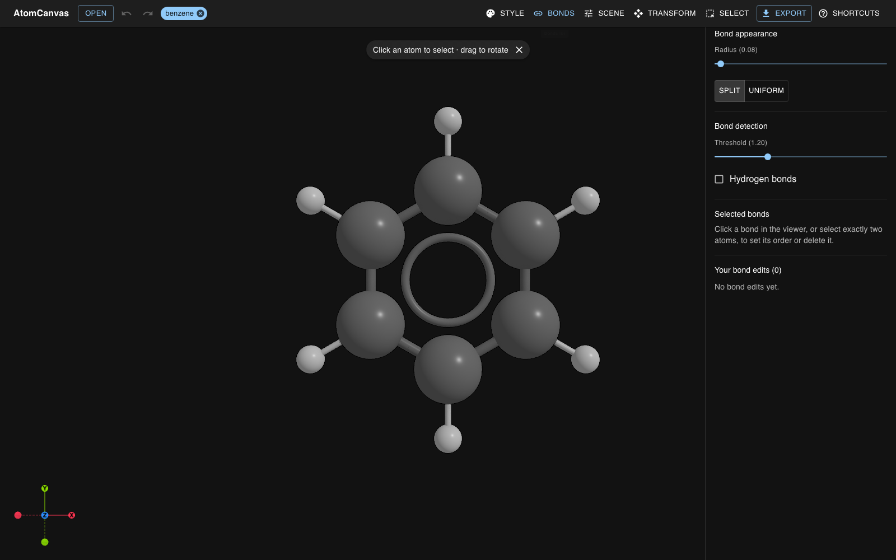
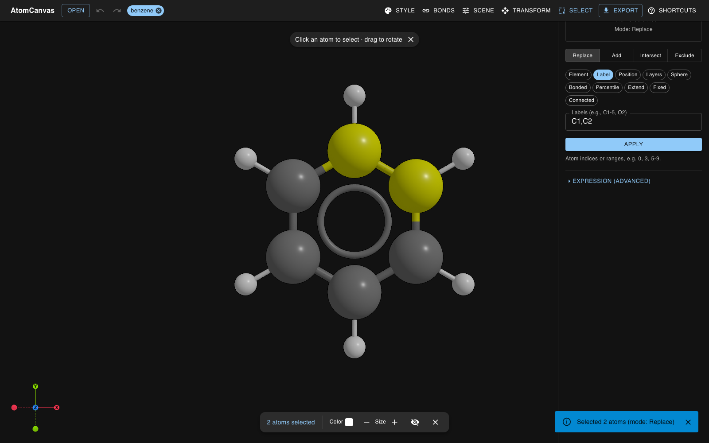
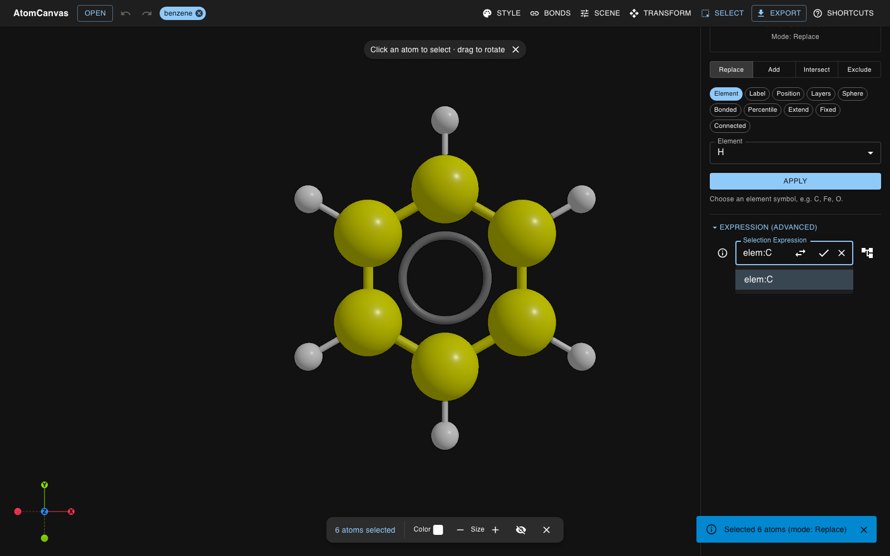
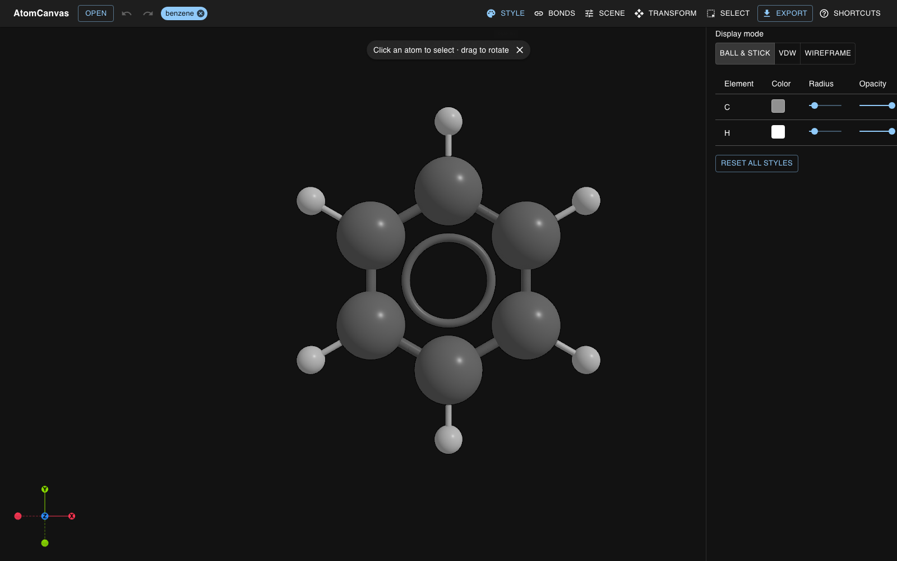
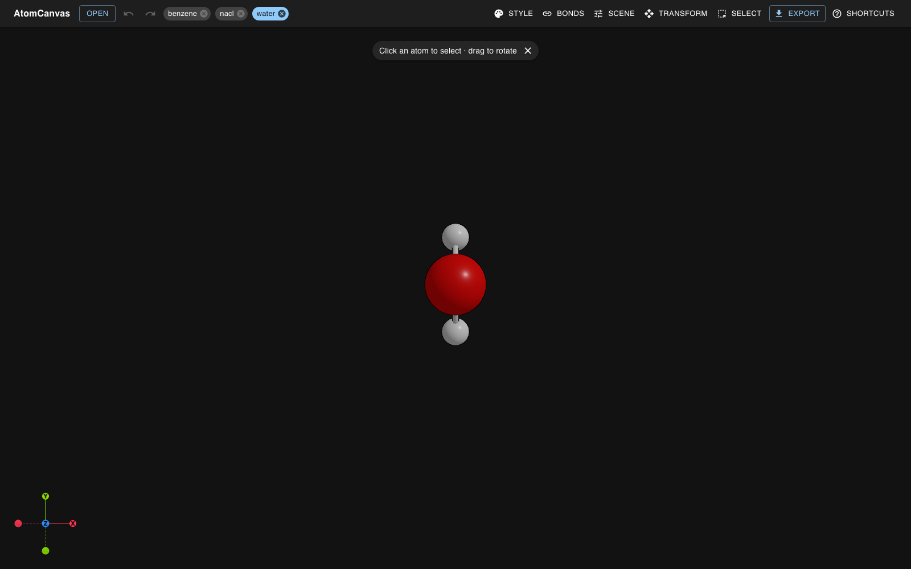
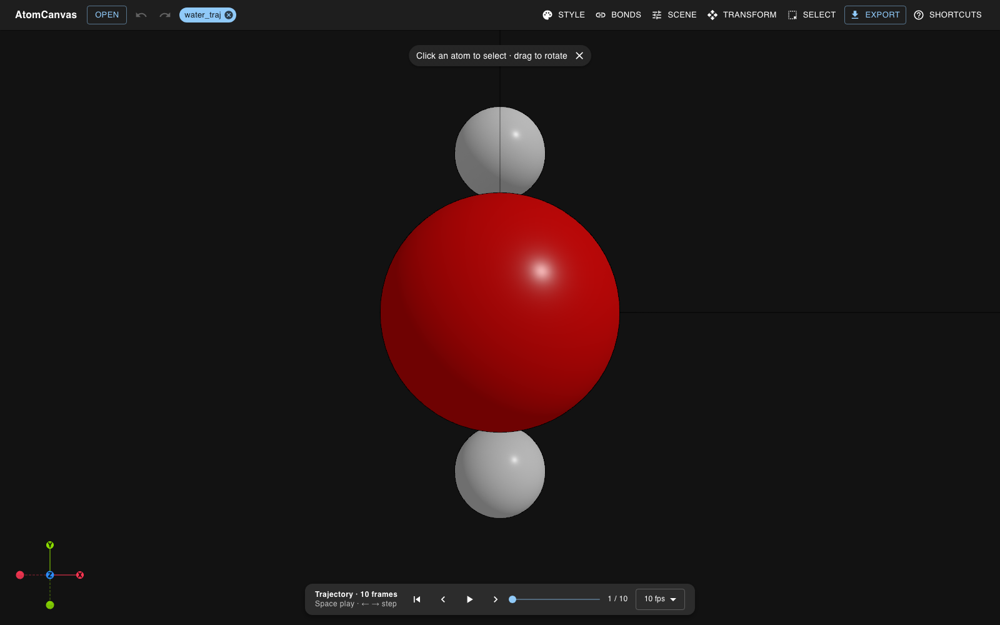

# Feature tour

A step-by-step walk through the main workflow. Each step is illustrated below;
see the [Gallery](GALLERY.md) for the full visual showcase.

## 1. Load a structure

Drag in (or open) a structure file — XYZ/extXYZ, CIF, VASP POSCAR, PDB, and
more. The backend parses it with ASE, infers bonding, and the viewer frames it
automatically.

## 2. Automatic bonding

Bonds are detected from covalent radii with a tunable threshold. When RDKit can
perceive them, you also get bond **orders** (double/triple) and **aromatic
rings**. PBC-aware ghost atoms and hydrogen bonds can be toggled on.

## 3. Manual bond editing

Select exactly two atoms to **create**, set the **order** of, or **delete** a
bond. Every override round-trips through the backend and can be reverted
individually or cleared all at once.

## 4. Selection DSL

Express selections like `elem:C AND pos:z>10`, `label:O1,H1`, with `AND` / `OR` /
`NOT` and parentheses; invert with one click. The same grammar is available
headlessly — see [CLI.md → Selection DSL](CLI.md#selection-dsl).

## 5. Styling

Per-element and per-atom colors and radii (CPK by default), plus scene controls:
camera presets, background, lighting presets, unit-cell / H-bond / ghost
toggles, and the bond threshold. Pick a display mode (ball-and-stick · vdW ·
wireframe) and, independently, a render style (standard · soft · cartoon).

## 6. Multiple structures in tabs

Open several structures at once in tabs, style each independently, and batch
export across all of them.

## 7. Trajectory playback

When an upload yields a multi-frame file, a bottom transport bar lets you scrub
and play back the frames. Playback is a pure view change — it never re-runs the
backend or pollutes undo.

## Next

- Export your work — [EXPORT.md](EXPORT.md)
- Script it headlessly — [CLI.md](CLI.md)
- Run it on your machine — [RUN.md](RUN.md)
