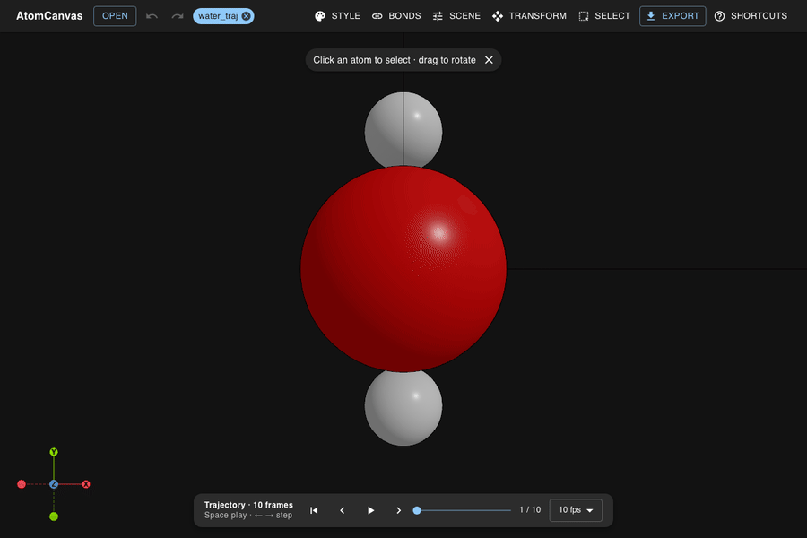
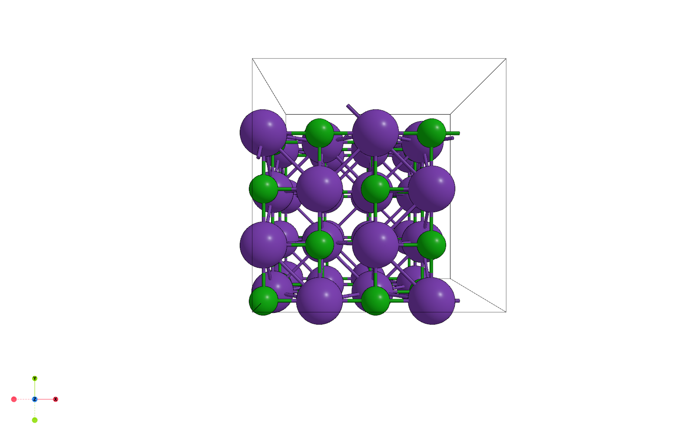

# Gallery

A visual tour of what AtomCanvas renders. AtomCanvas is a *visualization* app, so
these are the whole point.

## Molecules & crystals

<table>
  <tr>
    <td align="center" width="50%">
      
       Aromatic rings + RDKit-perceived bond orders
    </td>
    <td align="center" width="50%">
      
       Unit cell + PBC cross-boundary (ghost) bonds
    </td>
  </tr>
</table>

## Surfaces & trajectories

<table>
  <tr>
    <td align="center" width="50%">
      
       Layered surface slab
    </td>
    <td align="center" width="50%">
      
       Trajectory playback (10-frame ping-pong)
    </td>
  </tr>
</table>

## Render styles

Three built-in render styles. Standard shows C60 adsorbed on an
Ag2O surface; soft shows a 2D covalent framework; cartoon shows a metal
macrocycle.

<table>
  <tr>
    <td align="center" width="33%">
      
       Standard
    </td>
    <td align="center" width="33%">
      
       Soft
    </td>
    <td align="center" width="33%">
      
       Cartoon
    </td>
  </tr>
</table>

## Exports

  
   Supersampled PNG figure exported from the viewer

Structures also export as `.glb` 3D models that drop straight into a PowerPoint
slide. See [EXPORT.md](EXPORT.md) for the full export reference and the
glb → PowerPoint walkthrough.

## Demo

Upload a structure, rotate it, edit a bond, and open the export menu — in under 20 seconds.

  

